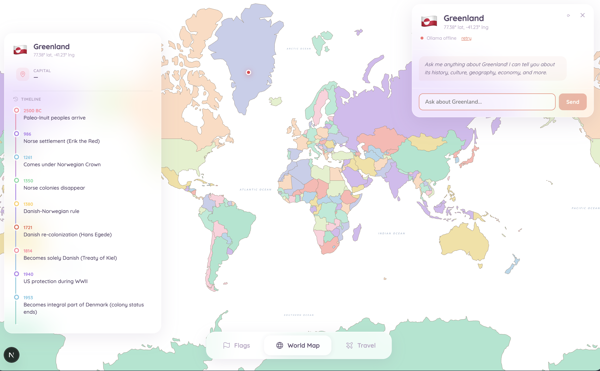
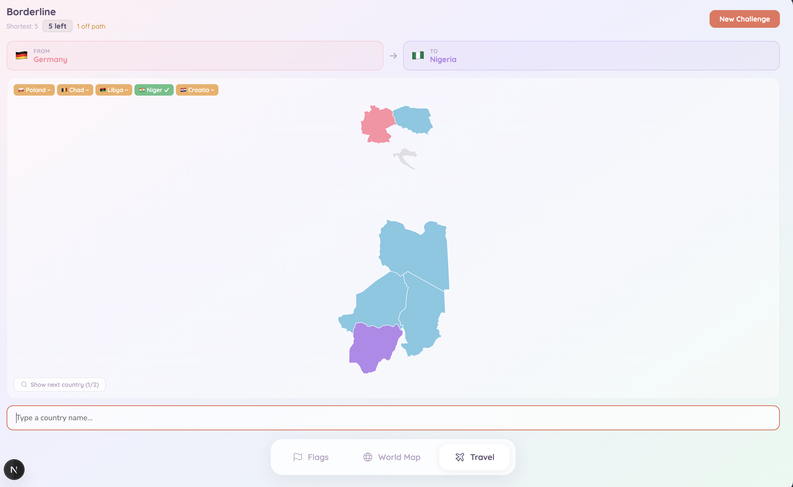

# World Explorer

An interactive geography app with three modes: an AI-powered world map, a flag quiz, and a border-pathfinding puzzle.

---
## Screenshots




## Features

### World Map
- Zoomable, pannable Mercator projection rendered with D3
- Click any country to open a fact card (capital, languages, population, currency, colonial history, timeline)
- Click fact-card items to ask the AI about them
- AI chat panel powered by a local [Ollama](https://ollama.com) model
- Hover pill shows country name, coordinates, and flag

### Flag Quiz
- 4-choice flag recognition game
- Score, accuracy percentage, and streak tracker
- Web Audio API sound effects
- Auto-advances after each answer; skip button available

### Borderline (Travel Challenge)
- Pick a land-border path between two randomly chosen countries
- BFS pathfinding validates guesses against the shortest route
- Color-coded feedback: green (on best path), orange (on any valid path), red (wrong)
- Two hint levels: reveal the next country outline, then reveal all country outlines
- 10 guesses per round

---

## Tech Stack

| Layer | Choice |
|---|---|
| Framework | Next.js 14+ (App Router) |
| Map rendering | D3.js (Mercator + Natural Earth projections) |
| Geodata | world-atlas@2 via CDN (TopoJSON → GeoJSON) |
| Country facts | REST Countries API v3.1 (no auth required) |
| AI chat | Ollama (local LLM, runs on `localhost:11434`) |
| Icons | Phosphor Icons via react-icons |
| Audio | Web Audio API |
| Styling | Inline CSS with glassmorphic / pastel design system |

---

## Getting Started

### Prerequisites

- Node.js 18+
- [Ollama](https://ollama.com) installed and running locally (for the AI chat feature)

### Install & run

```bash
npm install
npm run dev
```

Open [http://localhost:3000](http://localhost:3000). The app redirects to `/map` by default.

### AI chat setup

The chat panel requires Ollama running locally with at least one model pulled:

```bash
ollama serve          # start the server
ollama pull llama3    # or any model you prefer
```

The app auto-detects the running model. If Ollama is offline, the rest of the app still works — chat will show an offline error with a retry button.

---

## Project Structure

```
app/
├── layout.tsx              # Root layout — TabBar navigation
├── globals.css             # Fonts, resets, keyframe animations
├── page.tsx                # Redirects / → /map
├── map/page.tsx            # World map page
├── flags/page.tsx          # Flag quiz page
└── travel/page.tsx         # Borderline game page

components/
├── TabBar.tsx              # Bottom navigation (Flags / Map / Travel)
├── world-map/
│   ├── WorldMap.tsx        # D3 interactive map with zoom/pan and click
│   ├── HoverPill.tsx       # Country tooltip on hover
│   └── LoadingOverlay.tsx  # Spinner shown while geodata loads
├── chat/
│   ├── ChatPanel.tsx       # Ollama-powered chat (state + layout)
│   ├── ChatHeader.tsx      # Flag, country name, Ollama status
│   ├── MessageList.tsx     # Scrollable message bubbles
│   └── ChatInput.tsx       # Text input + send button
├── fact-card/
│   ├── FactCard.tsx        # Country quick-facts panel
│   ├── FactRow.tsx         # Reusable icon + label + value row
│   └── FactTimeline.tsx    # Historical timeline with gradient line
├── flag-quiz/
│   ├── FlagQuiz.tsx        # Quiz orchestrator (state + layout)
│   ├── ScoreBar.tsx        # Score / accuracy / streak display
│   └── AnswerOptions.tsx   # Four-button answer grid
└── travel/
    ├── TravelChallenge.tsx # Borderline game orchestrator
    ├── CountryPairDisplay.tsx # A → B country cards
    ├── GuessInput.tsx      # Autocomplete country input
    ├── GuessPills.tsx      # Guess chips overlaid on the map
    ├── HintControls.tsx    # Hint buttons (show next / show outlines)
    └── GameBanner.tsx      # Solved / failed overlay banner

lib/
├── types.ts                # Shared TypeScript interfaces
├── constants.ts            # Color palette, fill arrays, pill style
├── audio.ts                # Web Audio API helpers (correct/wrong/tuck/success)
├── countries.ts            # ISO code map and flag emoji converter
├── borders.ts              # Land-border graph, BFS pathfinding, pair picker
├── countryfacts.ts         # REST Countries API + hardcoded timelines & colonial history
├── ollama.ts               # Ollama connection check and streaming chat
├── topo2geo.ts             # TopoJSON → GeoJSON converter
└── waterLabels.ts          # Ocean / sea label positions and zoom thresholds
```

---

## Data Sources

| Data | Source |
|---|---|
| World geography | [world-atlas](https://github.com/topojson/world-atlas) (Natural Earth 110m) |
| Country metadata | [REST Countries API](https://restcountries.com) |
| Flag images | REST Countries API (PNG URLs) |
| Border graph | Hardcoded from Natural Earth country names |
| Colonial history & timelines | Hardcoded in `lib/countryfacts.ts` |
